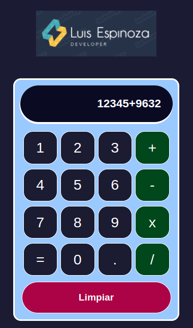

## Calculadora Reactiva

Esta aplicación fue para el curso Aprende React Desde Cero publicado en el canal  freeCodeCamp. Su estructura inicial fue creada con el comando `npx create-react-app`.

## Ejecutar la Aplicación

Para iniciar la aplicación, debes ejecutar el comando `npm start` en el terminal. 

La aplicación se abrirá automáticamente en el navegador configurado por defecto en tu dispositivo y se ejecutará en `localhost:3000`.

## Instalar Módulos

ra instalar los módulos necesarios para la aplicación, debes ejecutar el comando `npm install` en el terminal.

## Imagen de la Calculadora

